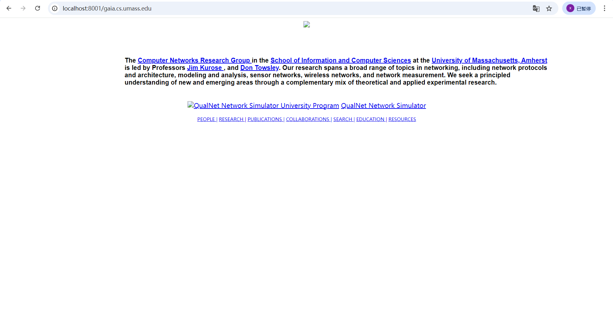

## ProxyServer Lab

```python
from socket import *
import sys
if len(sys.argv) <= 1:
    print('Usage : "python ProxyServer.py server_ip"\n[server_ip : It is the IP Address Of Proxy Server')
    sys.exit(2)
# Create a server socket, bind it to a port and start listening
tcpSerSock = socket(AF_INET, SOCK_STREAM)
# Fill in start.
tcpSerSock.bind(('',int(sys.argv[1])))
tcpSerSock.listen(1)
# Fill in end.

while 1:
    # Strat receiving data from the client
    print('Ready to serve...')
    tcpCliSock, addr = tcpSerSock.accept()
    print('Received a connection from:', addr)
    message = tcpCliSock.recv(1024).decode()# Fill in start. # Fill in end.
    print(message)
    # Extract the filename from the given message
    print(message.split()[1])
    filename = message.split()[1].partition("/")[2]
    print(filename)
    fileExist = "false"
    filetouse = "/" + filename
    print(filetouse)
    try:
        # Check wether the file exist in the cache
        f = open(filetouse[1:], "rb") 
        outputdata = f.read() 
        fileExist = "true"
        # ProxyServer finds a cache hit and generates a response message
        tcpCliSock.send("HTTP/1.0 200 OK\r\n".encode()) 
        tcpCliSock.send("Content-Type:text/html\r\n\r\n".encode())
        # Fill in start.
        tcpCliSock.send(outputdata)
        # Fill in end.
        print('Read from cache') 
# Error handling for file not found in cache
    except IOError:
        if fileExist == "false": 
            # Create a socket on the proxyserver
            c = socket(AF_INET,SOCK_STREAM)# Fill in start. # Fill in end.
            hostn = filename.replace("www.","",1) 
            print(hostn) 
            try:
                # Connect to the socket to port 80
                # Fill in start.
                c.connect((hostn,80))
                print(filename)
                # Fill in end.
                # Create a temporary file on this socket and ask port 80 for the file requested by the client
                fileobj = c.makefile('rwb', 0) 
                print(111)
                fileobj.write("GET ".encode() + '/ HTTP/1.0\r\nHost: '.encode()+ filename.encode() +'\r\n\r\n'.encode()) 
                print(222)
                # Read the response into buffer
                # Fill in start.
                sentence = fileobj.read()
                print(sentence)
                # Fill in end.
                # Create a new file in the cache for the requested file. 
                # Also send the response in the buffer to client socket and the corresponding file in the cache
                tmpFile = open(filename,"wb") 
                # Fill in start.
                # send to client
                sentence = sentence.split(b'\r\n\r\n')[1]
                print(sentence)
                tcpCliSock.send("HTTP/1.0 200 OK\r\n".encode())
                tcpCliSock.send("Content-Type:text/html\r\n\r\n".encode())
                tcpCliSock.send(sentence)
                # save in the file
                tmpFile.write(sentence)
                tmpFile.close()
                    # Fill in end.
            except:
                print("Illegal request") 
            c.close()
        else:
            # HTTP response message for file not found
            # Fill in start.
            tcpCliSock.send("HTTP/1.0 404 NOT FOUND\r\n\r\n") 
            # Fill in end.
    # Close the client and the server sockets 
    tcpCliSock.close() 
# Fill in start.
tcpSerSock.close()
# Fill in end.
```

有的网站可以代理成功




有的网站直接跳转到目标地址。还有的进不去。
