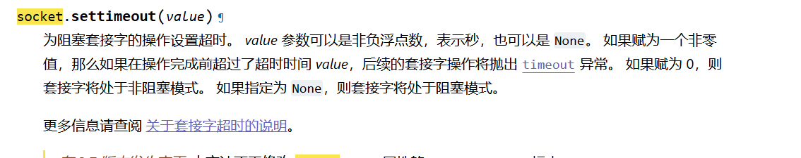
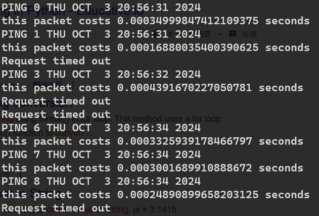
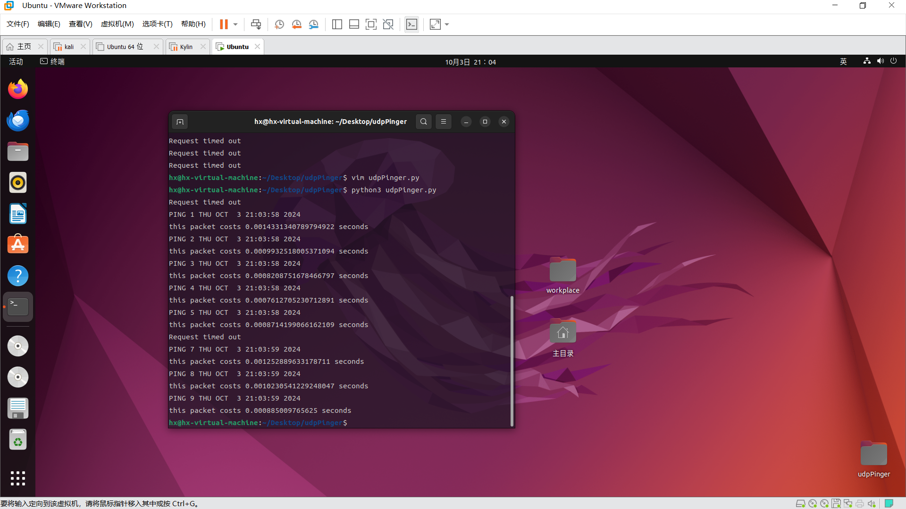

## Pinger Lab

查看服务器代码：

```python
# UDPPingerServer.py
# We will need the following module to generate randomized lost packets
import random
from socket import *
# Create a UDP socket 
# Notice the use of SOCK_DGRAM for UDP packets
serverSocket = socket(AF_INET, SOCK_DGRAM)
# Assign IP address and port number to socket
serverSocket.bind(('', 12000))
while True:
    # Generate random number in the range of 0 to 10
    rand = random.randint(0, 10) 
    # Receive the client packet along with the address it is coming from 
    message, address = serverSocket.recvfrom(1024)
    # Capitalize the message from the client
    message = message.upper()
    # If rand is less is than 4, we consider the packet lost and do not respond
    if rand < 4:
        continue
    # Otherwise, the server responds 
    serverSocket.sendto(message, address)
```

使用udp协议，本地socket绑定12000号端口，randint区间边界都取，故有11个数字，小于4代表有4个数字，4/11 > 30%。pdf不够严谨。因为校园网可能不存在丢包情况，所以用这种方式来模拟丢包。

根据python官方文档找到timeout方法



超时会抛出异常

还需要计时数据段发出和收到数据报的时间。

写出Pinger.py:

```python
# UDPPinger.py
from socket import *
from time import *

serverPort = 12000
clientSocket = socket(AF_INET, SOCK_DGRAM)

clientSocket.settimeout(1)
for i in range(0,10):
    try:
        message = 'Ping ' + str(i) + ' ' + ctime()
        time_start = time()
        clientSocket.sendto(message.encode(),('localhost',serverPort))
        modifiedMessage,serverAddress = clientSocket.recvfrom(2048)
        time_end = time()
        # message from server
        print(modifiedMessage.decode())
        # calculate the time
        print('this packet costs ' + str(time_end-time_start) +' seconds')

    except timeout:
        print('Request timed out')


clientSocket.close();
```




发生了四次超时。用虚拟机模仿远程机。

