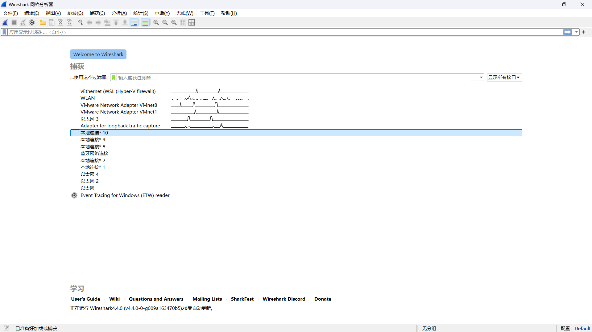
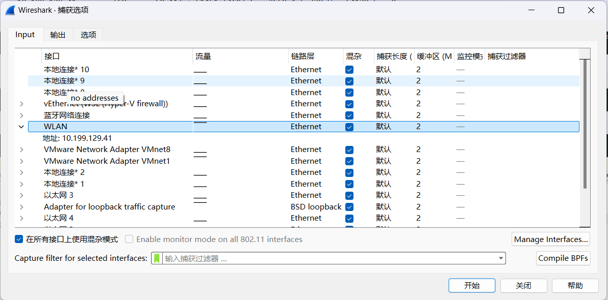
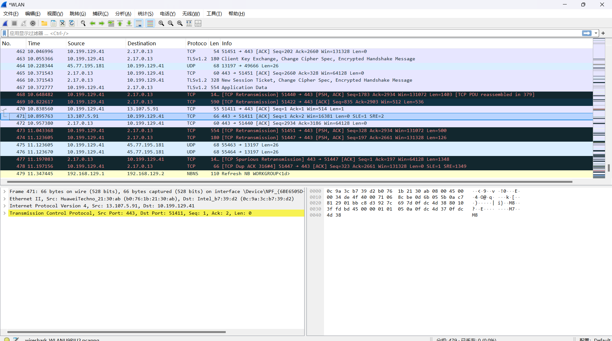
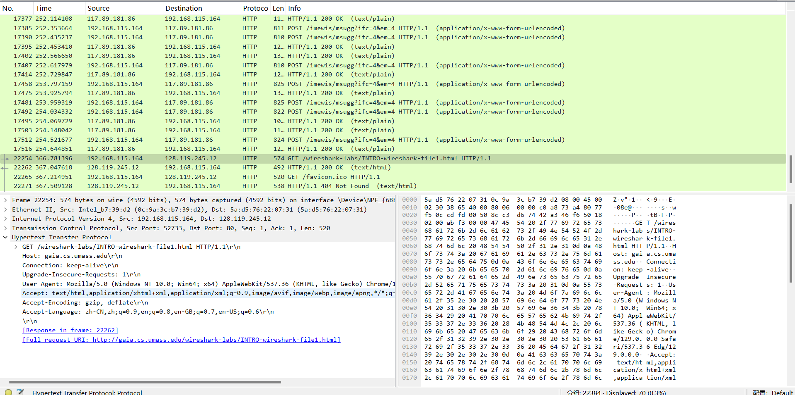

## Getting Started

安装程序 Wireshark

 

尝试跑Wireshark

1. 打开浏览器
2. 打开wireshark，并选择合适的网络接口

这里选择无线网，选择后，开始抓包。

3. 打开http://gaia.cs.umass.edu/wireshark-labs/INTRO-wireshark-file1.html

访问成功会有一句祝贺。

wireshark出现了许多不同的协议，不只是http协议。

4. 寻找访问gaia.cs.umass.edu的http get消息

注意浏览器会将http自动转为https协议，所以需要将s删除。

