## DNS Lab

### nslookup

默认dns服务器

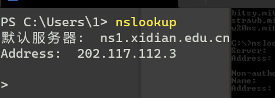

访问 www.mit.edu   消息包扩回应和回应的服务器，这里回应的服务器是ns1.xidian.edu.cn

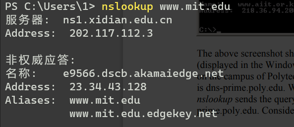

访问mit.edu的权威服务器，虽然是访问ns记录，但是nslookup也访问了IP地址：

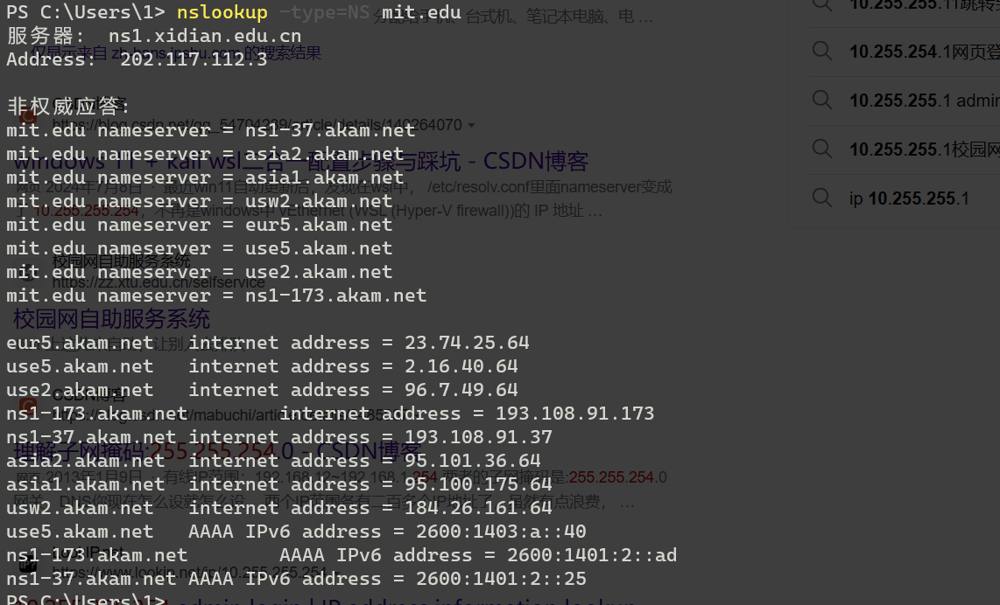


访问一个权威服务器：auth-ns2.csail.mit.edu，获得pdos.csail.mit.edu的ip

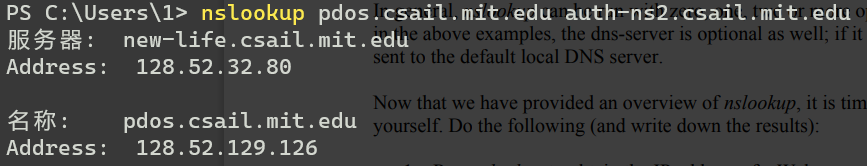

nslookup的一般格式：

```nslookup –option1 –option2 host-to-find dns-server```

- Run nslookup to obtain the IP address of a Web server in Asia. What is the IP  address of that server?

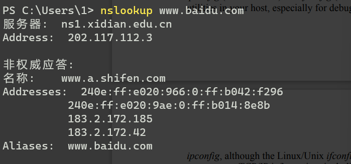

- Run nslookup to determine the authoritative DNS servers for a university in  Europe.

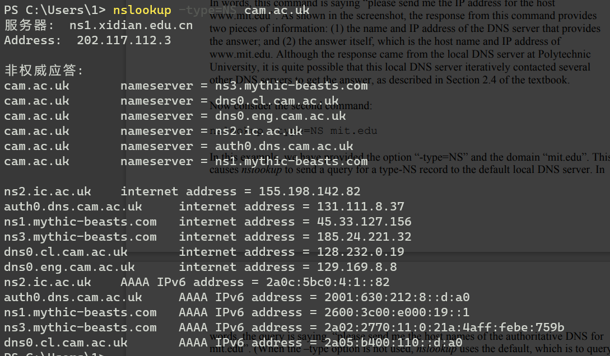

- Run nslookup so that one of the DNS servers obtained in Question 2 is queried for  the mail servers for Yahoo! mail. What is its IP address?

失败了。

选择一所中国大学：

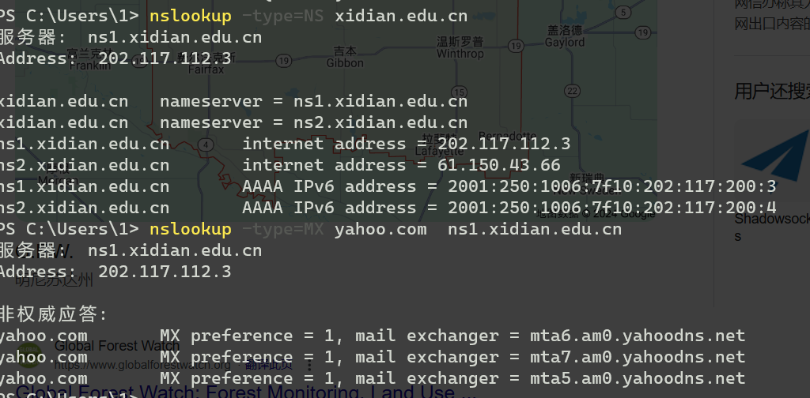

### ipconfig

主机全部信息：

```sh
ipconfig \all
```

展示dns缓存：

```sh
ipconfig /displaydns
```

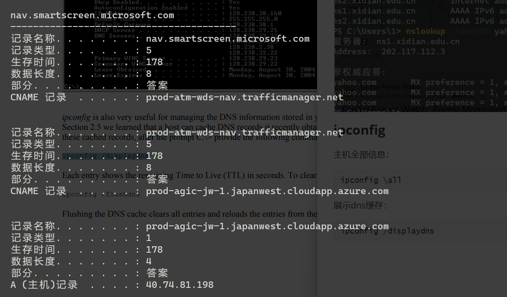

删除缓存：

```sh
ipconfig /flushdns
```

###  Tracing DNS with Wireshark

发送dns请求

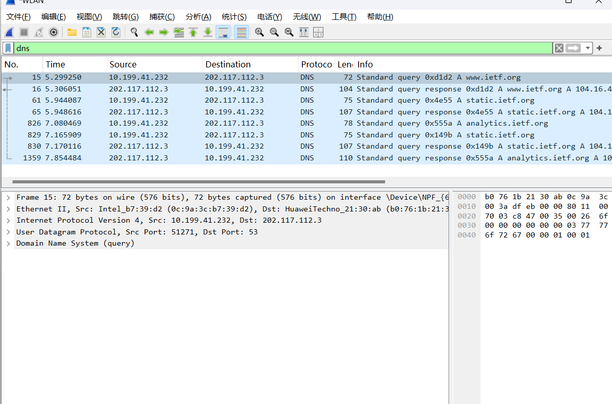

dns响应

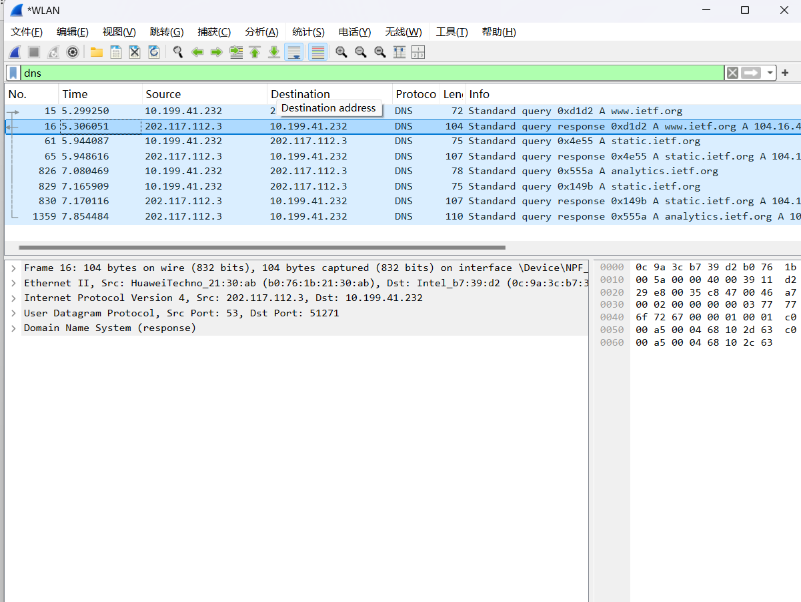

- Locate the DNS query and response messages. Are then sent over UDP or TCP? 

udp

- What is the destination port for the DNS query message? What is the source port  of DNS response message?

53，53

-  To what IP address is the DNS query message sent? Use ipconfig to determine the  IP address of your local DNS server. Are these two IP addresses the same?  

202.117.112.3，是其中之一

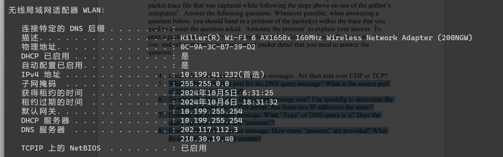

- Examine the DNS query message. What “Type” of DNS query is it? Does the  query message contain any “answers”?

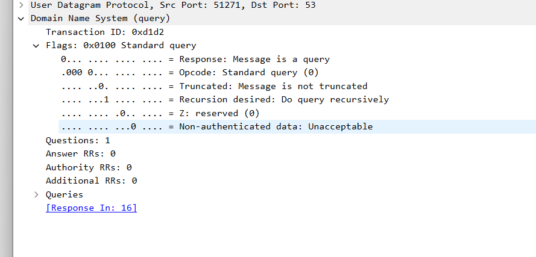 

-  Examine the DNS response message. How many “answers” are provided? What  do each of these answers contain?

2.域名对应的ip地址，a类型

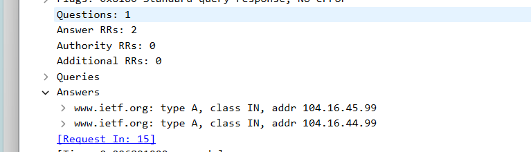

- Consider the subsequent TCP SYN packet sent by your host. Does the destination  IP address of the SYN packet correspond to any of the IP addresses provided in  the DNS response message? 

对应104.16.45.99

-  This web page contains images. Before retrieving each image, does your host  issue new DNS queries? 

没有

使用nslookup 查询www.mit.edu

- What is the destination port for the DNS query message? What is the source port  of DNS response message?

53,53

-   To what IP address is the DNS query message sent? Is this the IP address of your  default local DNS server? 

202.117.112.3

对应本地dns服务器

-  Examine the DNS query message. What “Type” of DNS query is it? Does the  query message contain any “answers”? 

0x0100 standard query 

no

- Examine the DNS response message. How many “answers” are provided? What  do each of these answers contain? 

Answers
    www.mit.edu: type CNAME, class IN, cname www.mit.edu.edgekey.net
    www.mit.edu.edgekey.net: type CNAME, class IN, cname e9566.dscb.akamaiedge.net
    e9566.dscb.akamaiedge.net: type A, class IN, addr 23.210.114.10

-  Provide a screenshot.

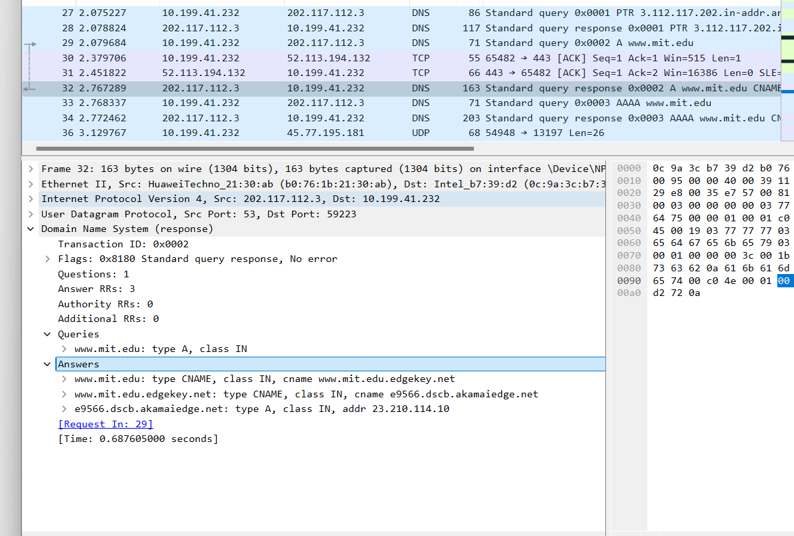

使用下列命令重复操作

```sh
nslookup -type=NS mit.edu
```

- To what IP address is the DNS query message sent? Is this the IP address of your  default local DNS server? 

202.117.112.3

对应本地dns服务器

-  Examine the DNS query message. What “Type” of DNS query is it? Does the  query message contain any “answers”? 

Flags: 0x0100 Standard query

no

- Examine the DNS response message. What MIT nameservers does the response  message provide? Does this response message also provide the IP addresses of the  MIT namesers? 

Answers
    mit.edu: type NS, class IN, ns use5.akam.net
    mit.edu: type NS, class IN, ns asia1.akam.net
    mit.edu: type NS, class IN, ns ns1-37.akam.net
    mit.edu: type NS, class IN, ns usw2.akam.net
    mit.edu: type NS, class IN, ns asia2.akam.net
    mit.edu: type NS, class IN, ns use2.akam.net
    mit.edu: type NS, class IN, ns ns1-173.akam.net
    mit.edu: type NS, class IN, ns eur5.akam.net

是

- Provide a screenshot

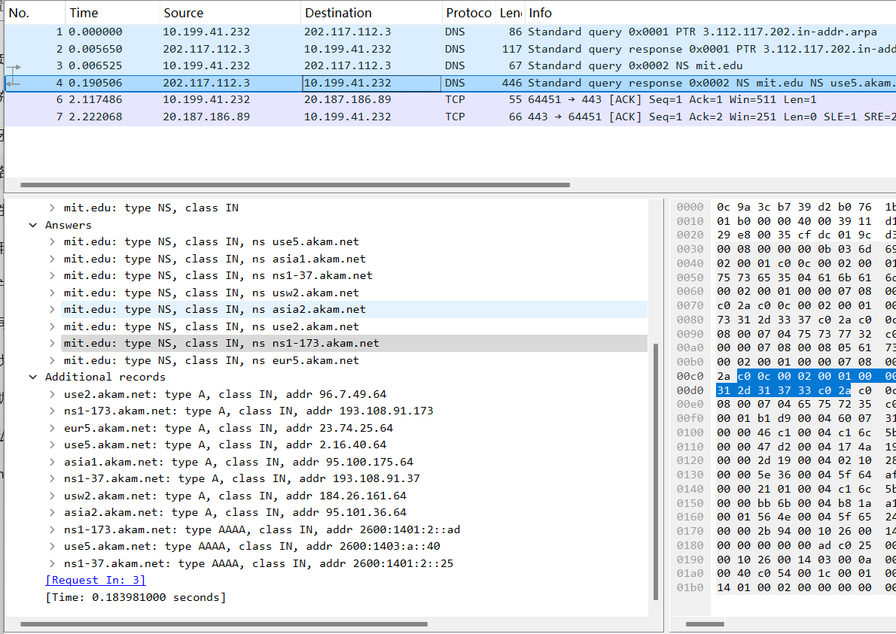


使用以下命令重复操作：

```sh
nslookup pdos.csail.mit.edu auth-ns2.csail.mit.edu
```

- To what IP address is the DNS query message sent? Is this the IP address of your  default local DNS server? If not, what does the IP address correspond to?

否。128.52.32.80对应：auth-ns2.csail.mit.edu

- Examine the DNS query message. What “Type” of DNS query is it? Does the  query message contain any “answers”? 

Flags: 0x0100 Standard query

no

-  Examine the DNS response message. How many “answers” are provided? What  does each of these answers contain?

Answers
    80.32.52.128.in-addr.arpa: type PTR, class IN, new-life.csail.mit.edu

- Provide a screenshot

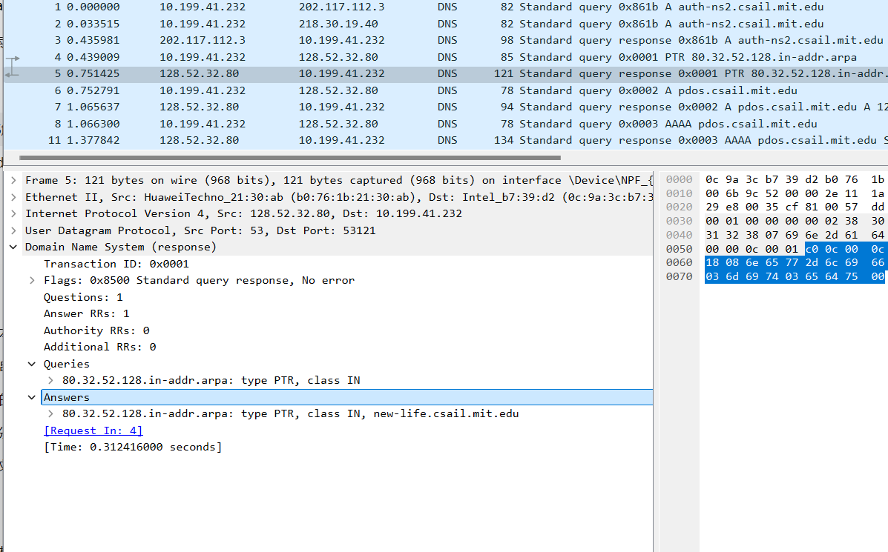