## lab tcp

###  Capturing a bulk TCP transfer from your computer to a remote  server

下载并上传文件。

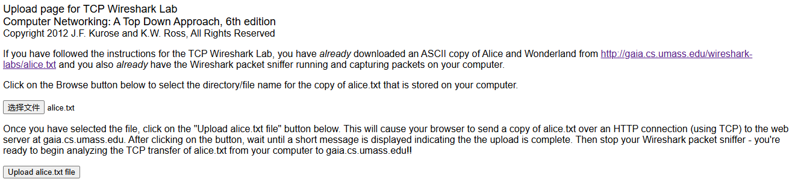

启动wireshark并开始捕获。点击上传按钮，并停止捕获。

 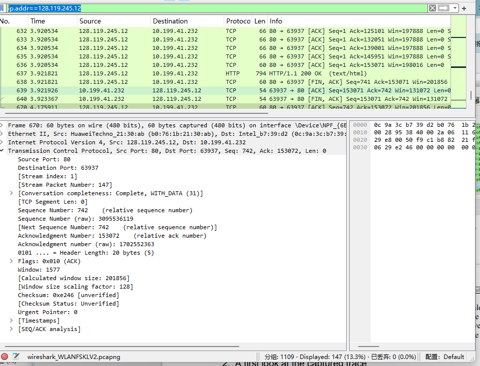

###  A first look at the captured trace

查看tcp 和http消息

一个post请求和其他tcp消息，还有两个syn

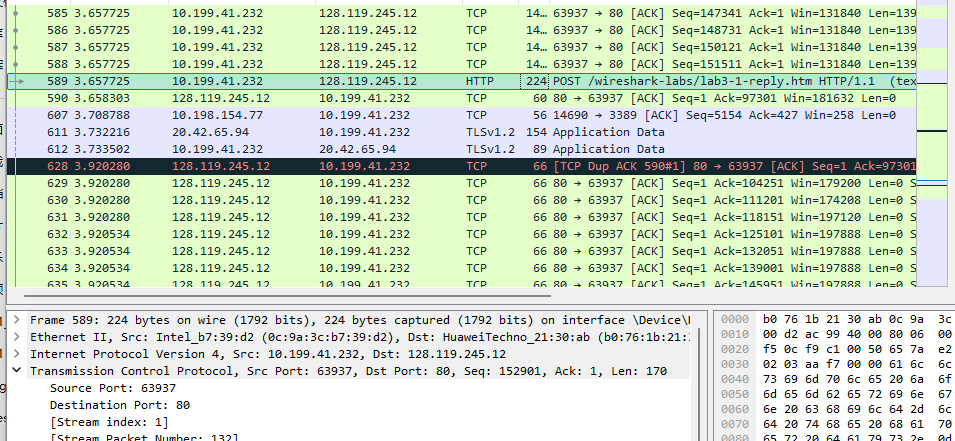

- What is the IP address and TCP port number used by the client computer (source)  that is transferring the file to gaia.cs.umass.edu? 

这个要求http的

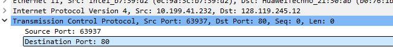

66521 10.199.41.232

- What is the IP address of gaia.cs.umass.edu? On what port number is it sending  and receiving TCP segments for this connection

目标端口：80；IP地址：128.119.245.12

- What is the IP address and TCP port number used by your client computer  (source) to transfer the file to gaia.cs.umass.edu? 

也一样

### TCP Basics

- What is the sequence number of the TCP SYN segment that is used to initiate the  TCP connection between the client computer and gaia.cs.umass.edu? What is it  in the segment that identifies the segment as a SYN segment? 

相对值：Sequence Number: 0    (relative sequence number)

真实值：Sequence Number (raw): 2886194304

标志位：Flags: 0x002 (SYN)

- What is the sequence number of the SYNACK segment sent by gaia.cs.umass.edu  to the client computer in reply to the SYN? What is the value of the  Acknowledgement field in the SYNACK segment? How did gaia.cs.umass.edu  determine that value? What is it in the segment that identifies the segment as a  SYNACK segment? 

Sequence Number: 0    (relative sequence number)

Sequence Number (raw): 3244475400

Acknowledgment Number: 1    (relative ack number)

Acknowledgment number (raw): 2886194305

ack= client发送的seq+1

Flags: 0x012 (SYN, ACK)

- What is the sequence number of the TCP segment containing the HTTP POST  command? Note that in order to find the POST command, you’ll need to dig into  the packet content field at the bottom of the Wireshark window, looking for a  segment with a “POST” within its DATA field.

Sequence Number (raw): 2886194305

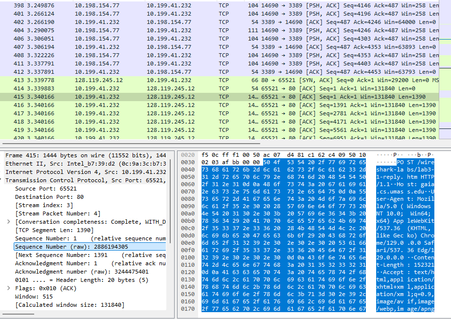

- Consider the TCP segment containing the HTTP POST as the first segment in the  TCP connection. What are the sequence numbers of the first six segments in the  TCP connection (including the segment containing the HTTP POST)? At what  time was each segment sent? When was the ACK for each segment received?  Given the difference between when each TCP segment was sent, and when its  acknowledgement was received, what is the RTT value for each of the six  segments? What is the EstimatedRTT value (see Section 3.5.3, page 242 in  text) after the receipt of each ACK? Assume that the value of the  EstimatedRTT is equal to the measured RTT for the first segment, and then is  computed using the EstimatedRTT equation on page 242 for all subsequent  segments.

六个tcp报文段的seq：

Sequence Number (raw): 2886194305

Sequence Number (raw): 2886195695

Sequence Number (raw): 2886197085

Sequence Number (raw): 2886198475

Sequence Number (raw): 2886199865

Sequence Number (raw): 2886201255

六个报文的发送时间：

[Time since first frame in this TCP stream: 0.251089000 seconds]

[Time since first frame in this TCP stream: 0.251089000 seconds]

[Time since first frame in this TCP stream: 0.251089000 seconds]

...

全都一样。

收到的时间，只收到了第六个tcp报文的确认：

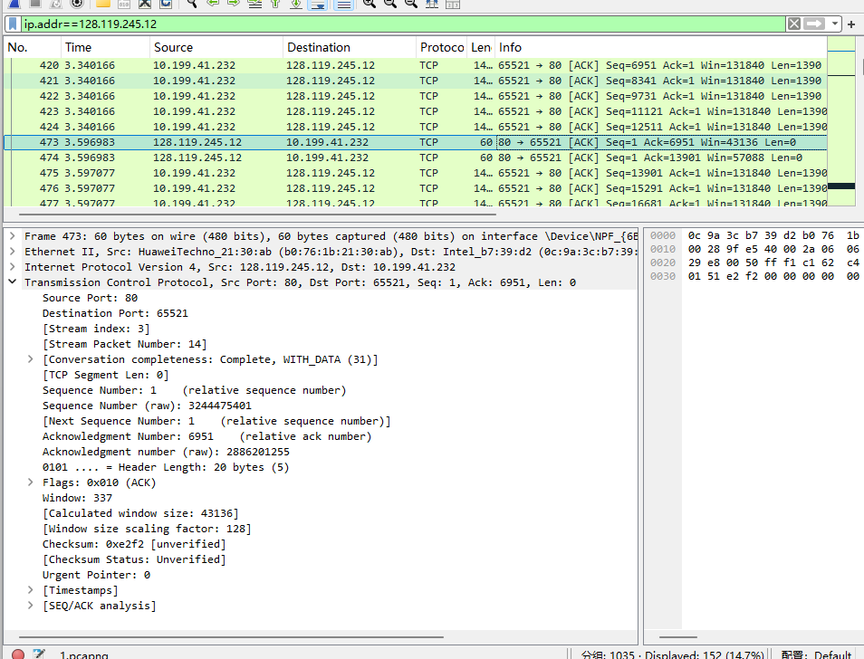

Acknowledgment number (raw): 2886201255

[Time since first frame in this TCP stream: 0.507906000 seconds]

所以第六个分组的RTT是[iRTT: 0.250806000 seconds]

由于这六个分组只有这一个确认，所以其他分组的RTT都为该值。

由于初始ERTT等于第一个SRTT,并且6个SRTT都相等，所以每次迭代值都没有发生变化。所以$ERTT_6=SRTT_1 =0.250806000 s$.

- What is the length of each of the first six TCP segments?

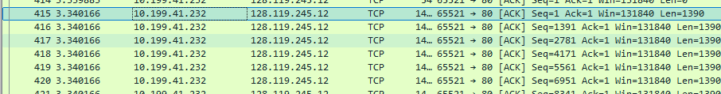

全是1390

- What is the minimum amount of available buffer space advertised at the received  for the entire trace? Does the lack of receiver buffer space ever throttle the  sender? 

29200

有，当发送的数据量快达到窗口大小，主机会等待服务器发送ack，包含新窗口的容量。

[TCP Window Size Scaling (networklessons.com)](https://networklessons.com/cisco/ccie-routing-switching-written/tcp-window-size-scaling)

- Are there any retransmitted segments in the trace file? What did you check for (in  the trace) in order to answer this question? 

没有，客户端查看是否有相同seq的报文段发出，服务器查看是否收到重复的确认号。

但是服务器有重复确认：

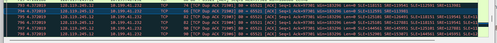

-  How much data does the receiver typically acknowledge in an ACK? Can you  identify cases where the receiver is ACKing every other received segment (see  Table 3.2 on page 250 in the text).

1390

找不到每隔一个报文段就确认的情况。

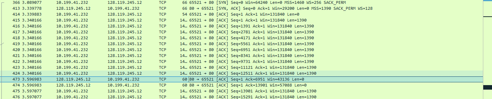

选定的那一行，是前5个报文段的确认。

-  What is the throughput (bytes transferred per unit time) for the TCP connection?  Explain how you calculated this value.

数据总量除以总时间。

结束时，客户端发送确认。序号为153071，故数据总量为153071-1=153070.

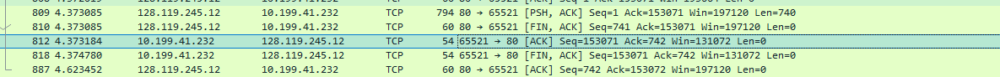

查找最后一个报文段，psh标志位

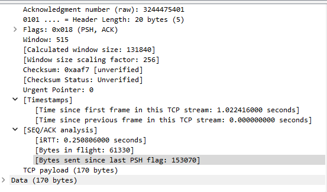

时间为T=1.022416+0.250806=1.273222s

$T_{吞吐} = D/T= 120,222.553490279 byte/s $

### TCP congestion control in action

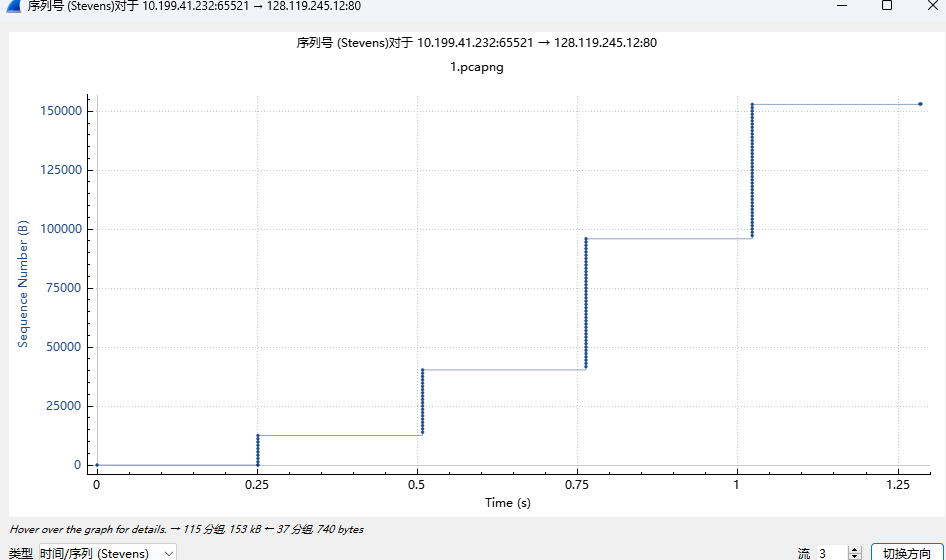

- Use the Time-Sequence-Graph(Stevens) plotting tool to view the sequence  number versus time plot of segments being sent from the client to the  gaia.cs.umass.edu server. Can you identify where TCP’s slowstart phase begins  and ends, and where congestion avoidance takes over? Comment on ways in  which the measured data differs from the idealized behavior of TCP that we’ve  studied in the text.

慢启动从0.25开始，1结束。拥塞避免从时间1.25开始，因为1s时收到了5个冗余ack，但由于数据发完，没什么影响。

$cwnd_1=13900byte$，$cwnd_2 = 27800byte$,$cwnd_3=55600$,$cwnd_4=55600 + 170$

最后一个报文段设置了PSH位。这里的慢启动的cwnd初始值不为1。

- Answer each of two questions above for the trace that you have gathered when  you transferred a file from your computer to gaia.cs.umass.ed

上面就是结合trace分析的。