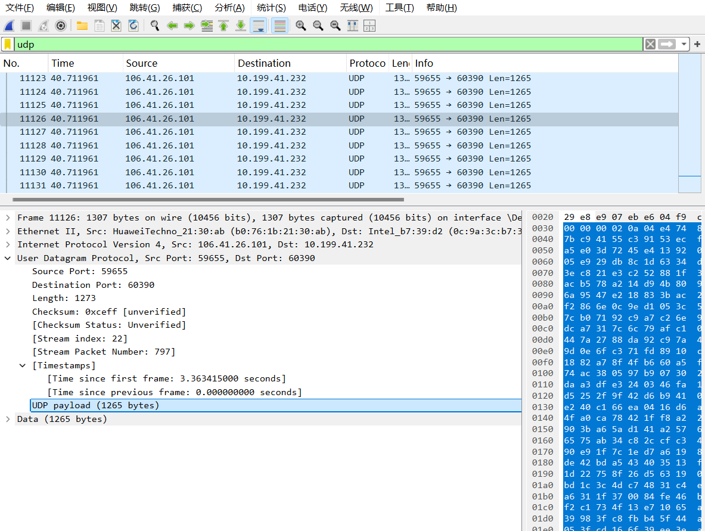
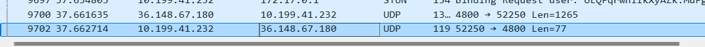

## lab5 UDP

先捕获一些udp报文段

- Select one UDP packet from your trace. From this packet, determine how many  fields there are in the UDP header. (You shouldn’t look in the textbook! Answer  these questions directly from what you observe in the packet trace.) Name these  fields.

 Src Port: 59655, Dst Port: 60390，Length: 1273，Checksum: 0xceff [unverified]，UDP payload (1265 bytes)。一共5个字段

- By consulting the displayed information in Wireshark’s packet content field for  this packet, determine the length (in bytes) of each of the UDP header fields. 

source port 两个字节，dport :2,lenth:2，checksum：2。

- The value in the Length field is the length of what? (You can consult the text for  this answer). Verify your claim with your captured UDP packet. 

头部以及data的和。

- What is the maximum number of bytes that can be included in a UDP payload?  (Hint: the answer to this question can be determined by your answer to 2. above) 

由于lenth的长度是两个字节，所以udp的payload最大长度是2^16-1-8=65527 。

- What is the largest possible source port number? (Hint: see the hint in 4.) 

2^16-1

- What is the protocol number for UDP? Give your answer in both hexadecimal and  decimal notation. To answer this question, you’ll need to look into the Protocol  field of the IP datagram containing this UDP segment (see Figure 4.13 in the text,  and the discussion of IP header fields).  

Protocol: UDP (17)

- Examine a pair of UDP packets in which your host sends the first UDP packet and  the second UDP packet is a reply to this first UDP packet. (Hint: for a second  packet to be sent in response to a first packet, the sender of the first packet should  be the destination of the second packet). Describe the relationship between the  port numbers in the two packets.

第一个的源端口等于第二个的目标端口，第一个的目标端口等于第二个的源端口。

