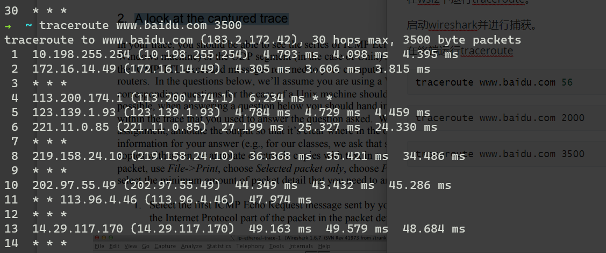
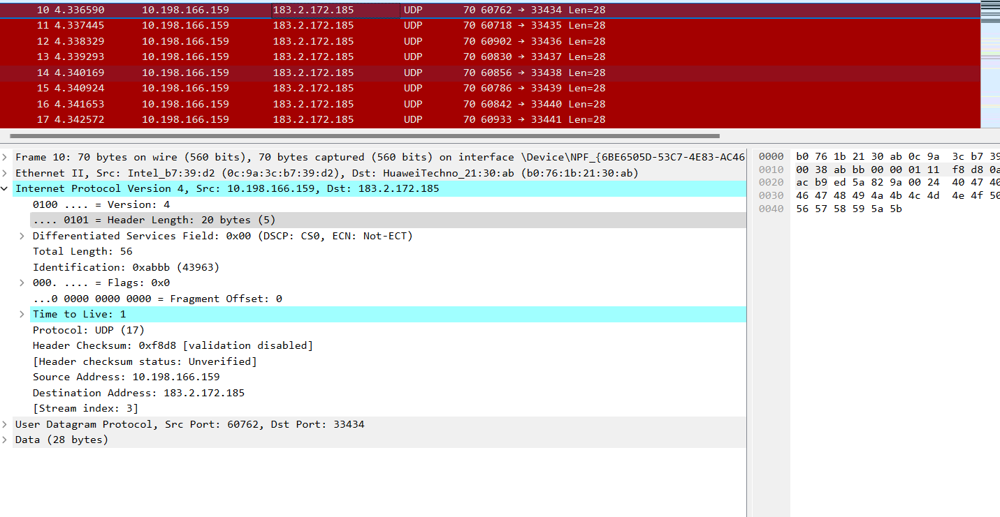
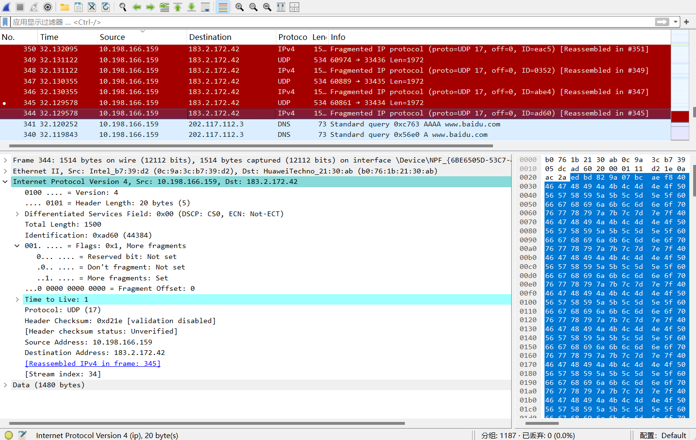
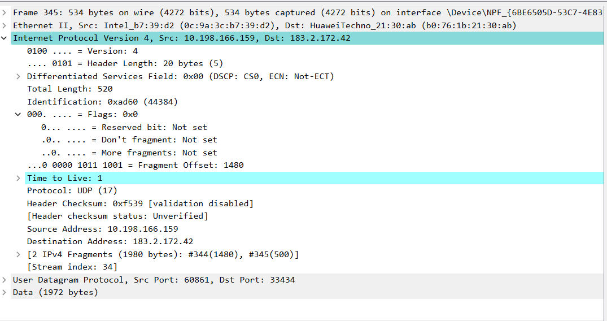

### lab6 ip

```
traceroute [-m #] [-q #] [-w #] [-p #] {IP_address|host_name}

         where
            -m   is the maximum allowable TTL value, measured as
            the number of hops allowed before the program terminates
            (default = 30)
            -q   is the number of UDP packets that will be sent with
            each time-to-live setting (default = 3)
            -w   is the amount of time, in seconds, to wait for
            an answer from a particular router before giving up
            (default= 5)
            -p   is the invalid port address at the remote host
            (default = 33434)
```

###  Capturing packets from an execution of traceroute

通过ttl和ttl衰减至0导致路由器发送icmp报文给主机的特性，我们认知到主机和路由器的关系。

在wsl2下运行traceroute。

启动wireshark并进行捕获。

在终端运行traceroute

```c++
traceroute www.baidu.com 56
```

```
traceroute www.baidu.com 2000
```

```
traceroute www.baidu.com 3500
```



###  A look at the captured trace

在linux下发送的是udp报文，收到的是icmp报文。

- . Select the first ICMP Echo Request message sent by your computer, and expand  the Internet Protocol part of the packet in the packet details window. What is the IP address of your computer



主机ip是10.198.166.159

- Within the IP packet header, what is the value in the upper layer protocol field? 

Protocol: UDP (17)

-  How many bytes are in the IP header? How many bytes are in the payload of the  IP datagram? Explain how you determined the number of payload bytes. 

.... 0101 = Header Length: 20 bytes (5)

payload为36

因为Total Length: 56

- Has this IP datagram been fragmented? Explain how you determined whether or  not the datagram has been fragmented

    000. .... = Flags: 0x0
        0... .... = Reserved bit: Not set
        .0.. .... = Don't fragment: Not set
        ..0. .... = More fragments: Not set
    ...0 0000 0000 0000 = Fragment Offset: 0

fragment为没被设置并且偏移为0，说明没被分片。

- Which fields in the IP datagram always change from one datagram to the next  within this series of ICMP messages sent by your computer? 

checksum、Identification、ttl

-  Which fields stay constant? Which of the fields must stay constant? Which fields  must change? Why? 

version,head len,sourece ad,dest ad,protocol

source ad,dest ad,version,protocol,head len

checksum,identification

-  Describe the pattern you see in the values in the Identification field of the IP  datagram

在icmp协议中增加1，但是ubuntu下是随机的（udp）。

- What is the value in the Identification field and the TTL field? 

Identification: 0x01e3 (483)

Time to Live: 255

-  Do these values remain unchanged for all of the ICMP TTL-exceeded replies sent  to your computer by the nearest (first hop) router? Why?

no。主机每发送一个报文，id加一。ttl保持不变。

- . Find the first ICMP Echo Request message that was sent by your computer after  you changed the Packet Size in pingplotter to be 2000. Has that message been  fragmented across more than one IP datagram?

是的。两份。

- Print out the first fragment of the fragmented IP datagram. What information in  the IP header indicates that the datagram been fragmented? What information in  the IP header indicates whether this is the first fragment versus a latter fragment?  How long is this IP datagram



more fragment 被标志了。

offset 为0.

1500.

- Print out the second fragment of the fragmented IP datagram. What information in  the IP header indicates that this is not the first datagram fragment? Are the more  fragments? How can you tell? 



offset不为0.

没有更多，因为more segment 为0

-  What fields change in the IP header between the first and second fragment?

checksum, total len,identification,flags,offset,

- How many fragments were created from the original datagram?

3

- What fields change in the IP header among the fragments

checksum, total len,identification,flags,offset

flags 和offset 只有在最后一个片才发生改变
