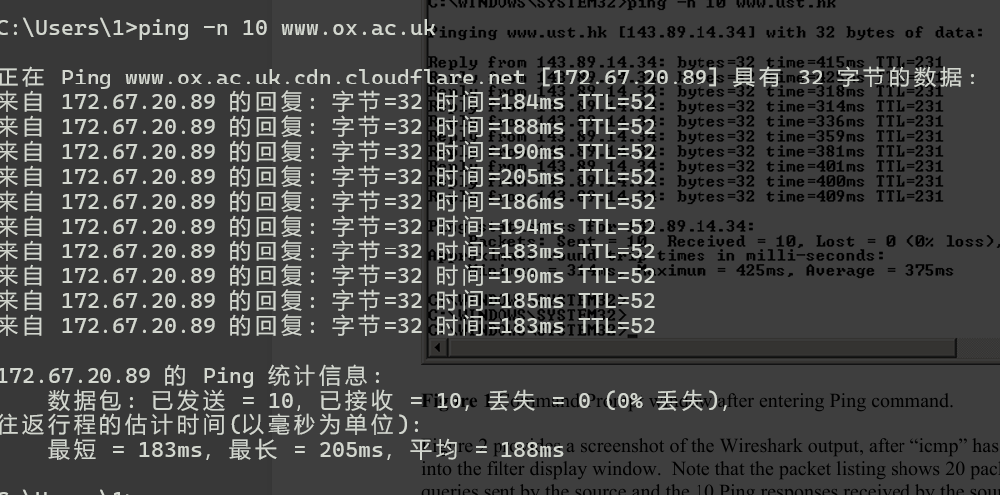
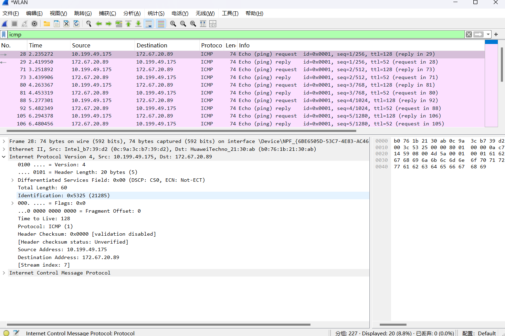
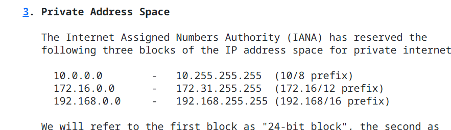
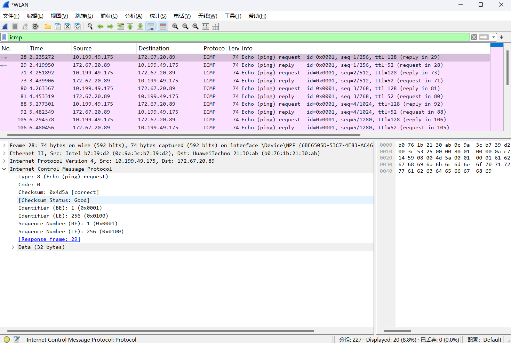
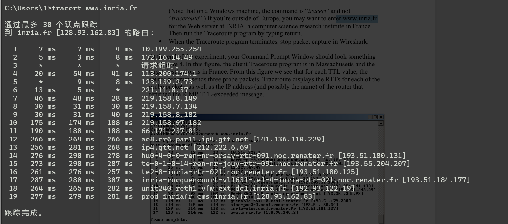
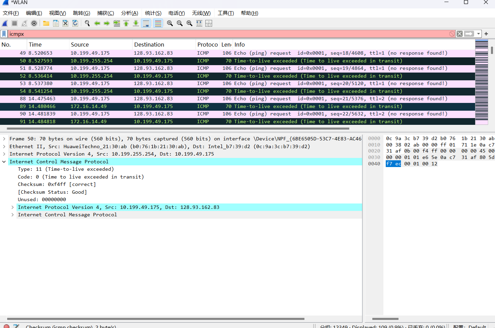
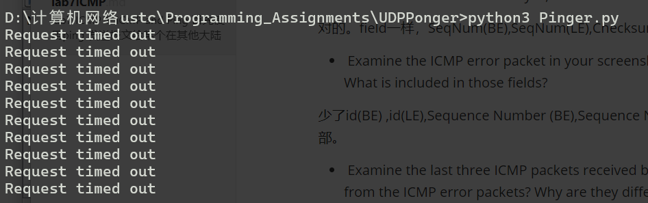

## lab7 ICMP

### 1. ICMP and Ping 

首先使用ping 发送报文给某个在其他大陆的主机，然后用wireshark截获。

这里选择 www.ox.ac.uk

ip数据报的protocol首部显示ICMP(1),说明ip的有效载荷是icmp

这三种是内网ip，说明源主机在内网中。

查看icmp报文各个字段

- What is the IP address of your host? What is the IP address of the destination  host?  

10.199.49.175

172.67.20.89

- Why is it that an ICMP packet does not have source and destination port  numbers? 

ICMP 不传到进程。传到操作系统。

下面是比较正确的答案：

**it was designed to communicate network-layer information between hosts and routers, not between application layer processes**

- Examine one of the ping request packets sent by your host. What are the ICMP  type and code numbers? What other fields does this ICMP packet have? How  many bytes are the checksum, sequence number and identifier fields? 

Type: 8 (Echo (ping) request) Code: 0

还有checksum，id(BE) ,id(LE),Sequence Number (BE),Sequence Number (LE),data

2,2,2,2,2

-  Examine the corresponding ping reply packet. What are the ICMP type and code  numbers? What other fields does this ICMP packet have? How many bytes are the  checksum, sequence number and identifier fields? 

Type: 0 (Echo (ping) reply)  Code: 0

一样

一样

### 2. ICMP and Traceroute

运行tracert 连接 www.inria.fr

wireshark 截获的报文

-  What is the IP address of your host? What is the IP address of the target  destination host?   

10.199.49.175(内网地址) 128.92.162.83

-  If ICMP sent UDP packets instead (as in Unix/Linux), would the IP protocol  number still be 01 for the probe packets? If not, what would it be?  

no。会变成udp的编号 0x11。 [List of IP protocol numbers - Wikipedia](https://en.wikipedia.org/wiki/List_of_IP_protocol_numbers)

-  Examine the ICMP echo packet in your screenshot. Is this different from the  ICMP ping query packets in the first half of this lab? If yes, how so?  

对的。field一样，SeqNum(BE),SeqNum(LE),Checksum不同。

-  Examine the ICMP error packet in your screenshot. It has more fields than the  ICMP echo packet. What is included in those fields? 

少了id(BE) ,id(LE),Sequence Number (BE),Sequence Number (LE)，但是多了Unused首部，和发送的ip报文首部。

-  Examine the last three ICMP packets received by the source host. How are these  packets different from the ICMP error packets? Why are they different? 

Type 不同，是reply类型。因为到达了目标主机，而不是在路由器丢失。

- Within the tracert measurements, is there a link whose delay is significantly  longer than others?  Refer to the screenshot in Figure 4, is there a link whose  delay is significantly longer than others?  On the basis of the router names, can  you guess the location of the two routers on the end of this link? 

是的。也是的。图4可以猜测是从美国到法国的两个边界路由器。我本地看不出来，因为增加最多的但是网段一样。

### 3. Extra Credit 

udp的[编程作业](../../Programming_Assigments/UDPPonger) 

域名改成www.baidu.com 但是请求超时。估计作业写得太烂了，只能连接本地。

