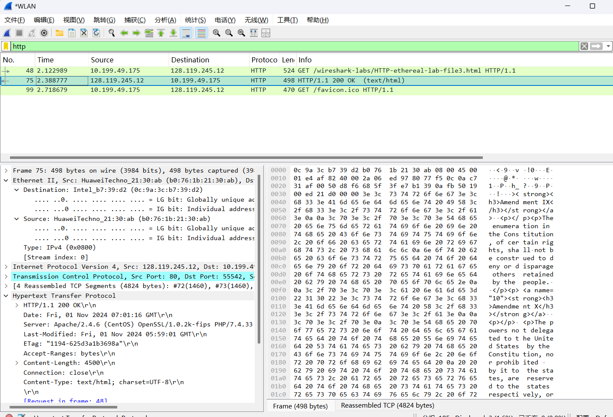
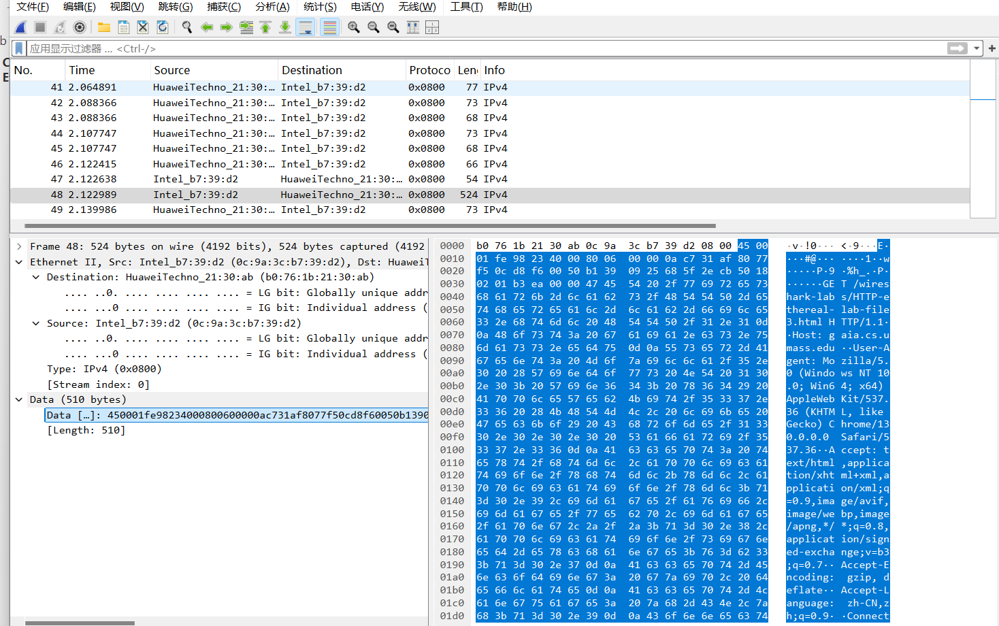
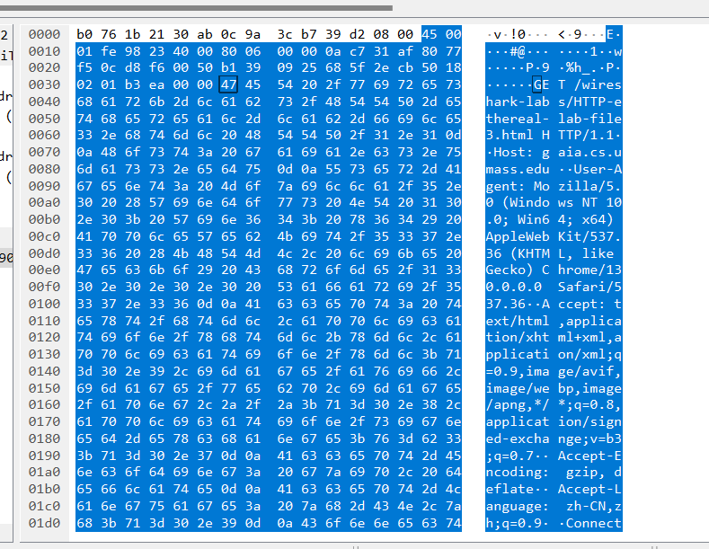
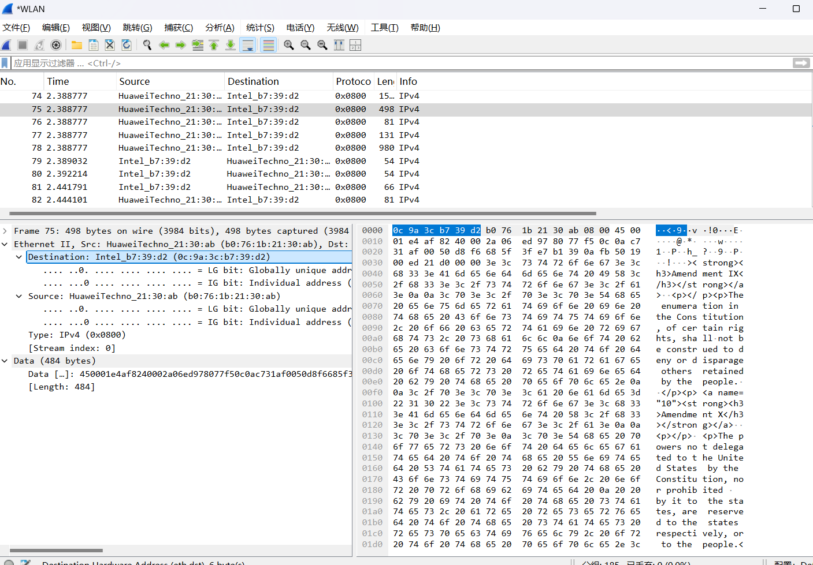
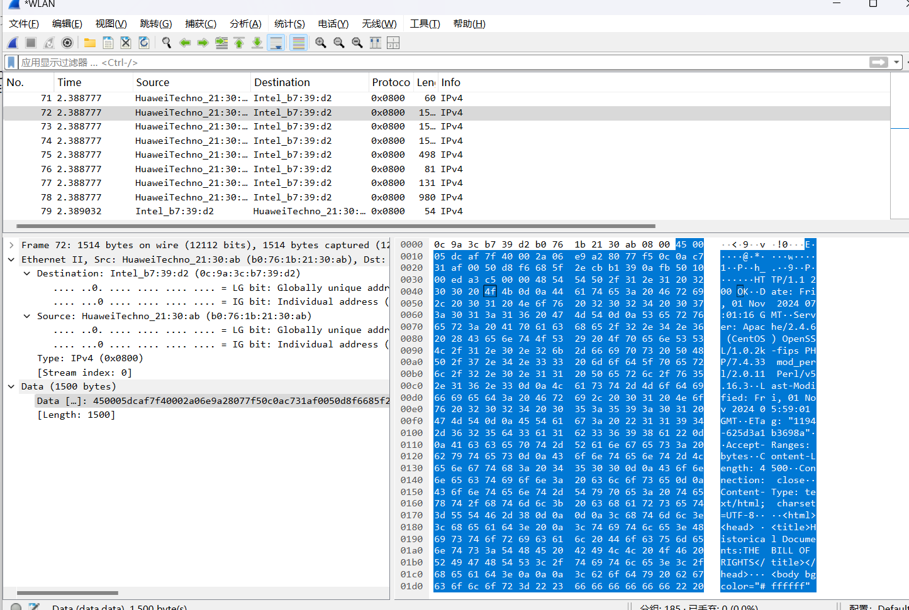
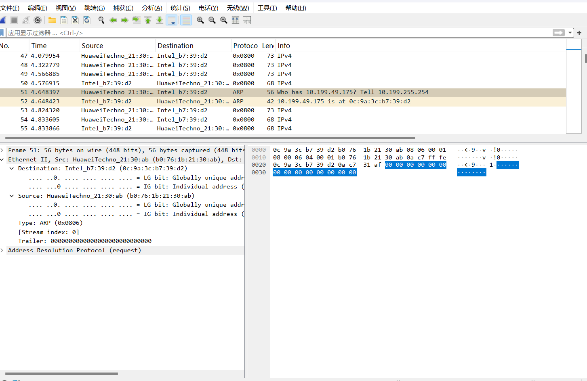
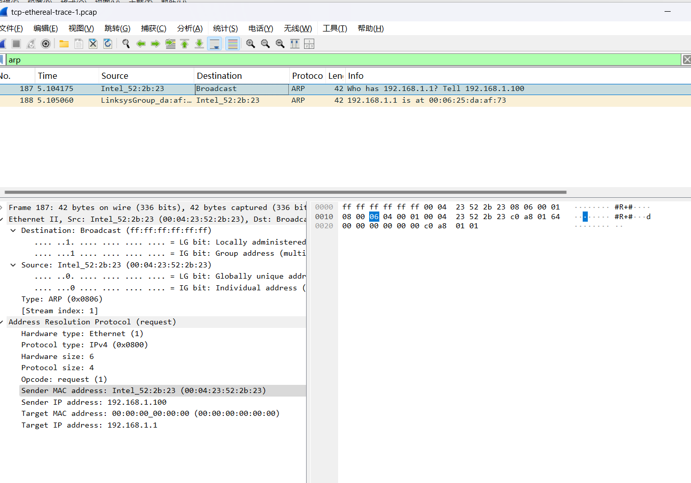
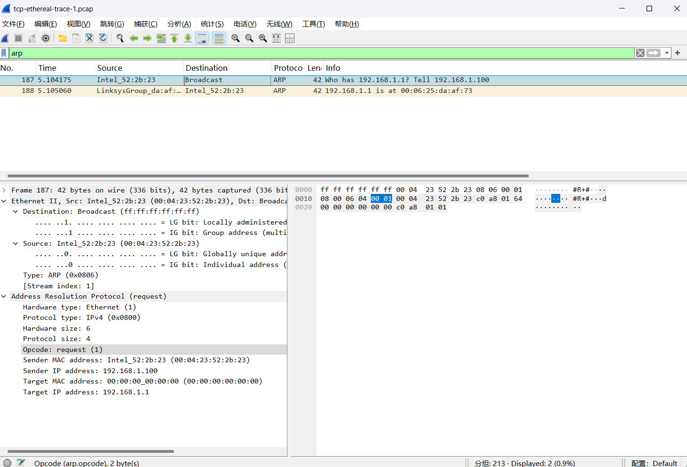
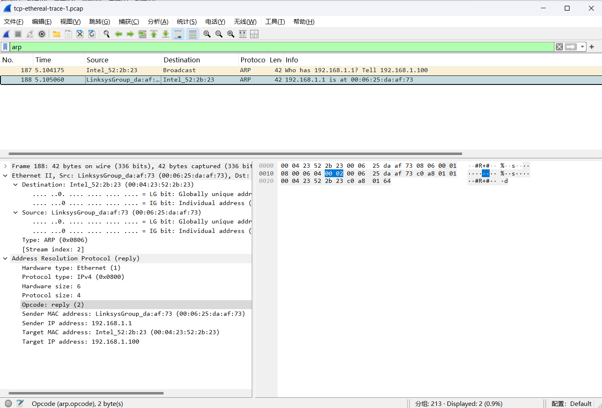

## lab Ethernet and ARP

### Capturing and analyzing Ethernet frames 

清除谷歌浏览器访问记录

然后打开wireshark，开始捕获无线网

访问网页http://gaia.cs.umass.edu/wireshark-labs/HTTP-ethereal-lab-file3.html

然后停止捕获，捕获到httpget，请求48，响应75.



在分析->启用协议中，选择IPv4,只展示IP层以下的协议



- What is the 48-bit Ethernet address of your computer? - 

Source: Intel_b7:39:d2 (0c:9a:3c:b7:39:d2)

- What is the 48-bit destination address in the Ethernet frame?  Is this the Ethernet  address of gaia.cs.umass.edu? (Hint: the answer is no).  What device has this as its  Ethernet address? [Note: this is an important question, and one that students  sometimes get wrong.  Re-read pages 468-469 in the text and make sure you  understand the answer here.]  

Destination: HuaweiTechno_21:30:ab (b0:76:1b:21:30:ab) 连着华为路由器

no

出口路由器的MAC地址

- Give the hexadecimal value for the two-byte Frame type field.  What upper layer  protocol does this correspond to?  

Type: IPv4 (0x0800) 

- How many bytes from the very start of the Ethernet frame does the ASCII “G” in  “GET” appear in the Ethernet frame? 

0x36



-  What is the value of the Ethernet source address?  Is this the address of your  computer, or of gaia.cs.umass.edu (Hint: the answer is no).   What device has this  as its Ethernet address?  、

Source: HuaweiTechno_21:30:ab (b0:76:1b:21:30:ab)

no 

是路由器的地址



- What is the destination address in the Ethernet frame?  Is this the Ethernet address  of your computer?  

Destination: Intel_b7:39:d2 (0c:9a:3c:b7:39:d2) 

yes，可以看到和上面一致

-  Give the hexadecimal value for the two-byte Frame type field. What upper layer  protocol does this correspond to? 

Type: IPv4 (0x0800)

-  How many bytes from the very start of the Ethernet frame does the ASCII “O” in  “OK” (i.e., the HTTP response code) appear in the Ethernet frame?

由于网页内容太多，分成很多个帧发送，所以O所在分组和一开始那个序号不同。



0x43

### 2. The Address Resolution Protocol

运行win上的rap程序，用来查看缓存的内容。而ARP定义发送消息的格式和意义，以及定义收发的动作。

-  Write down the contents of your computer’s ARP cache.  What is the meaning of  each column value? 

ip地址，物理地址，类型，动态代表广播（他人或自己）得到的，静态是固定的。

```
C:\Users\1>arp -a

接口: 192.168.110.1 --- 0x5
  Internet 地址         物理地址              类型
  192.168.110.254       00-50-56-e4-6f-ee     动态
  192.168.110.255       ff-ff-ff-ff-ff-ff     静态
  224.0.0.2             01-00-5e-00-00-02     静态
  224.0.0.22            01-00-5e-00-00-16     静态
  224.0.0.251           01-00-5e-00-00-fb     静态
  224.0.0.252           01-00-5e-00-00-fc     静态
  239.255.255.250       01-00-5e-7f-ff-fa     静态
  255.255.255.255       ff-ff-ff-ff-ff-ff     静态

接口: 10.199.49.175 --- 0x9
  Internet 地址         物理地址              类型
  10.199.255.254        b0-76-1b-21-30-ab     动态
  10.199.255.255        ff-ff-ff-ff-ff-ff     静态
  224.0.0.2             01-00-5e-00-00-02     静态
  224.0.0.22            01-00-5e-00-00-16     静态
  224.0.0.251           01-00-5e-00-00-fb     静态
  224.0.0.252           01-00-5e-00-00-fc     静态
  239.255.255.250       01-00-5e-7f-ff-fa     静态
  255.255.255.255       ff-ff-ff-ff-ff-ff     静态

接口: 169.254.184.56 --- 0xd
  Internet 地址         物理地址              类型
  169.254.255.255       ff-ff-ff-ff-ff-ff     静态
  224.0.0.2             01-00-5e-00-00-02     静态
  224.0.0.22            01-00-5e-00-00-16     静态
  224.0.0.251           01-00-5e-00-00-fb     静态
  224.0.0.252           01-00-5e-00-00-fc     静态
  239.255.255.250       01-00-5e-7f-ff-fa     静态

接口: 192.168.129.1 --- 0x11
  Internet 地址         物理地址              类型
  192.168.129.254       00-50-56-e0-1e-0e     动态
  192.168.129.255       ff-ff-ff-ff-ff-ff     静态
  224.0.0.2             01-00-5e-00-00-02     静态
  224.0.0.22            01-00-5e-00-00-16     静态
  224.0.0.251           01-00-5e-00-00-fb     静态
  224.0.0.252           01-00-5e-00-00-fc     静态
  239.255.255.250       01-00-5e-7f-ff-fa     静态
  255.255.255.255       ff-ff-ff-ff-ff-ff     静态
```

```
arp -d *
```

管理员模式下，运行上面这条指令，然后清除浏览器记录。

打开wireshark捕获

访问http://gaia.cs.umass.edu/wireshark-labs/HTTP-wireshark-lab-file3.html

停止捕获



由于是无线网，arp行为不一样，目的地址不是广播地址。

使用官方的采集包。



-  What are the hexadecimal values for the source and destination addresses in the  Ethernet frame containing the ARP request message?  

Source: Intel_52:2b:23 (00:04:23:52:2b:23)

Destination: Broadcast (ff:ff:ff:ff:ff:ff)

- Give the hexadecimal value for the two-byte Ethernet Frame type field.  What  upper layer protocol does this correspond to?  

Type: ARP (0x0806)

- Download the ARP specification from  ftp://ftp.rfc-editor.org/in-notes/std/std37.txt. A readable, detailed discussion of  ARP is also at http://www.erg.abdn.ac.uk/users/gorry/course/inet-pages/arp.html.   a) How many bytes from the very beginning of the Ethernet frame does the  ARP opcode field begin?    b) What is the value of the opcode field within the ARP-payload part of the  Ethernet frame in which an ARP request is made?  c) Does the ARP message contain the IP address of the sender?  d) Where in the ARP request does the “question” appear – the Ethernet  address of the machine whose corresponding IP address is being queried? 

(a) 0x14

(b) 0x0001

(c) yes

(d) Target IP address: 192.168.1.1



-  Now find the ARP reply that was sent in response to the ARP request.   a) How many bytes from the very beginning of the Ethernet frame does the  ARP opcode field begin?    b) What is the value of the opcode field within the ARP-payload part of the  Ethernet frame in which an ARP response is made?  c) Where in the ARP message does the “answer” to the earlier ARP request  appear – the IP address of the machine having the Ethernet address whose  corresponding IP address is being queried?  

(a) 0x14

(b) 0x0002

(c) Sender MAC address: LinksysGroup_da:af:73 (00:06:25:da:af:73)



-  What are the hexadecimal values for the source and destination addresses in the  Ethernet frame containing the ARP reply message?  

Sender Mac 是源，Target Mac是目标地址。

- Open the ethernet-ethereal-trace-1 trace file in  http://gaia.cs.umass.edu/wireshark-labs/wireshark-traces.zip. The first and second  ARP packets in this trace correspond to an ARP request sent by the computer  running Wireshark, and the ARP reply sent to the computer running Wireshark by  the computer with the ARP-requested Ethernet address.  But there is yet another  computer on this network, as indicated by packet 6 – another ARP request.  Why  is there no ARP reply (sent in response to the ARP request in packet 6) in the  packet trace?

因为对应arp reply 是单播的。因为只有相应ip地址的主机或路由器才会回复，所以运行wireshark的主机不会回复。